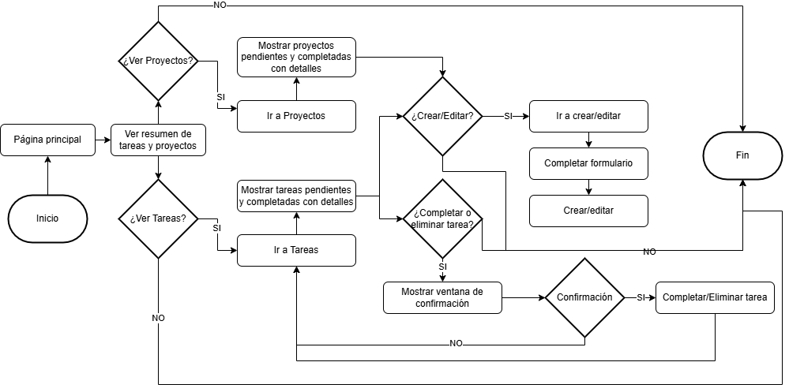
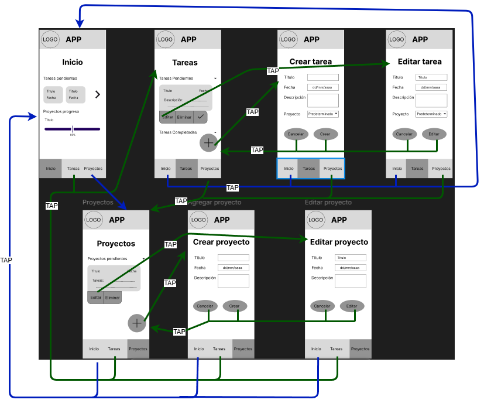

<h1 align="center">TaskMaster</h1>

 <em>Organiza tus proyectos. Domina tus tareas.</em> 

  

---

## 🧠 ¿De qué trata TaskMaster?

**TaskMaster** es una aplicación híbrida (web y móvil) diseñada para ayudarte a gestionar proyectos y tareas de forma clara, sencilla y eficiente. Perfecta para usuarios individuales que desean mantener sus pendientes bajo control.

### 🎯 Objetivo
Permitir una gestión integral de tareas y proyectos con una interfaz moderna, fluida y accesible desde dispositivos móviles o navegador web.

---

## ⚙️ Características principales

- 📁 **Gestión de proyectos y tareas**: crea, edita y organiza tus actividades por proyectos.
- 🧠 **Personalización**: Permite de manera visual mediante colores clasificar los proyectos y tareas
- 🌐 **Aplicación híbrida**: accesible como app móvil y web.
- 🖌️ **Interfaz moderna y responsive** con diseño personalizado usando **SCSS**.

---

## 🧪 Tecnologías utilizadas

<table>
  <tr>
    <th>Tecnología</th>
    <th>Descripción</th>
  </tr>
  <tr>
    <td>
      
      <strong align="center">React</strong>
    </td>
    <td>Framework principal para la interfaz</td>
  </tr>
  <tr>
    <td>
      
      <strong align="center">Vite</strong>
    </td>
    <td>Bundler rápido y moderno para desarrollo web</td>
  </tr>
  <tr>
    <td>
      
      <strong align="center">SCSS</strong>
    </td>
    <td>Estilos personalizados con preprocesador CSS</td>
  </tr>
  <tr>
    <td>
      
      <strong align="center">Capacitor</strong>
    </td>
    <td>Plataforma para ejecutar apps web como móviles (Android/iOS)</td>
  </tr>
</table>

---

## 🖼️ Capturas de pantalla

  
  
  
  
  
  

## Diagramas y Diseño

A continuación se presentan los diagramas principales que guiaron la planificación y estructura de **TaskMaster**:

  
   
  <em>Diagrama de flujo: muestra la lógica y recorrido general del sistema.</em>

  
   
  <em>Diagrama de navegación: describe cómo se conectan las diferentes pantallas de la app.</em>

---

🎨 Puedes explorar el diseño visual y prototipo interactivo en Figma:  
[🔗 Ver en Figma](https://www.figma.com/design/SwOR46bNjk6BT4nihyFB9r/Gestion_Tareas?node-id=0-1&t=MJsHqW6xSXGHeddD-1)

---

## 📲 Descargar

**¡Disponible en Google Play!**  
📦 [TaskMaster](https://play.google.com/store/apps/details?id=co.edu.upb.taskmaster)

---

## 🚧 Estado del proyecto

- [x] Diseño de diagramas
- [x] Diseño de pantallas (papel y Figma)
- [x] Desarrollo
- [x] Publicación en Play Store
- [x] Mejora de UI

---

Desarrollado por Ivan Tang Zhu

## Comandos utilizados durante desarrollo

- `npm install` Instala las dependencias
- `npm run dev` Para levantar el servidor en etapa de desarrollo
- `npm run build` Crea la carpeta dist con los archivos optimizados, los cuales se utilizan para el emulador y posteriomente al apk
- `npx cap sync` Sincroniza la carpeta dist con app
- `npx cap run android` Ejecuta la aplicación en el emulador de Android Studio o también se puede hacer desde el botón en Android Studio
